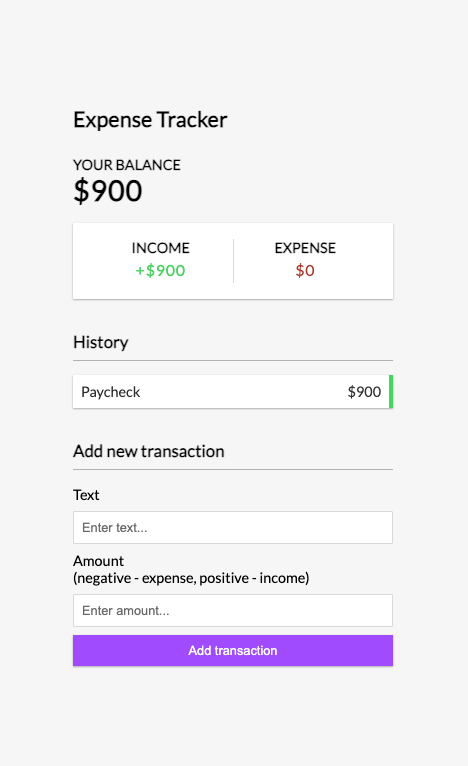
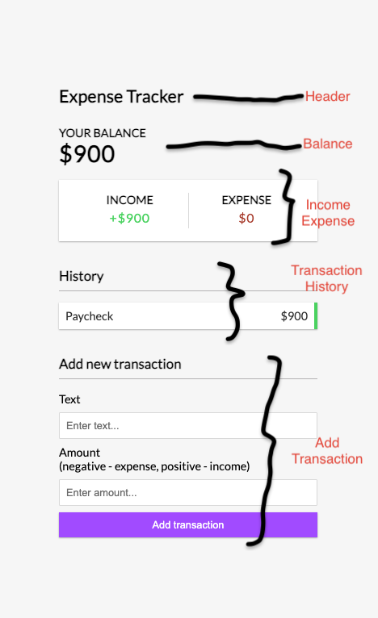

# vue-expense-tracker

This template should help get you started developing with Vue 3 in Vite.

## Recommended IDE Setup

[VSCode](https://code.visualstudio.com/) + [Volar](https://marketplace.visualstudio.com/items?itemName=Vue.volar) (and disable Vetur).

## Customize configuration

See [Vite Configuration Reference](https://vite.dev/config/).

## Project Setup

```sh
npx create-vue@latest .
```
This is to create the vue app using the latest version of vue and loaded at the current folder / directory you cd into.

```sh
npm install
```

### Compile and Hot-Reload for Development

```sh
npm run dev
```

### Compile and Minify for Production

```sh
npm run build
```
## The Project
This project is a replication of the Expense Tracker by Brad Traversy using the Vue 3.2 Composite API. The css and configuration are from the url below

https://github.com/bradtraversy/vanillawebprojects/tree/master/expense-tracker

### The Project UI
This is the user interface of the project styled with style.css from Brad's vanilla javascript version in the link earlier shared.



### The components of the UI
The components for this project are built around the annotation in the ui png below to help properly provide guide on how the components are created.

